# Uncovering Global Music Patterns Through Spotify Data

This project combines web scraping, music metadata APIs, visualization, and natural language processing to study how Spotify listening patterns vary across countries. We compared where popular artists come from, which genres lead regional charts, how song characteristics differ across markets, and what themes and emotions appear in popular lyrics. Below is a project overview and summary of results, whereas full details are included in the report: [`STA220_Final_Report.pdf`](STA220_Final_Report.pdf)

## Project overview

Spotify chart data was scraped from [Kworb](https://kworb.net/) with Beautiful Soup and enriched with:

- **MusicBrainz** artist country and genre metadata
- **Spotify API** track duration, explicit-content labels, and release dates
- **Genius API** lyrics for topic modeling, sentiment analysis, and keyword analysis

The global analysis used the top 20 weekly songs from 76 countries (1,540 chart entries) and the top 500 artists from the all-time global chart. Song-feature comparisons used Top 50 charts from ten markets, while the NLP analysis used 198 successfully matched songs from the Spotify US Top 200.

## Key results

### Global and regional music trends

- The United States had the highest weekly stream total in the collected data. The next largest markets included Mexico, Indonesia, Brazil, India, Italy, Turkey, the United Kingdom, and France.
- English-speaking artists dominated the historical Top 500: 245 artists were from the US and 58 from the UK, together representing roughly 60% of the list.
- Pop and hip-hop were the most common historical genres, while recent charts showed the growing influence of reggaeton and other Latin genres.
- Regional preferences remained distinct. European charts leaned toward pop and hip-hop, while several Asian markets favored local genres such as J-rock, K-pop, Filmi, and Indonesian pop.
- Domestic-artist listening varied considerably across countries. Israel, Hungary, South Korea, Indonesia, Egypt, Finland, and India had especially high domestic shares, while many Latin American and English-proficient markets streamed more international artists.

#### Country comparison visualizations

The results below show the geographic scale of Spotify listening, the genres represented by globally popular artists, the balance between domestic and international artists, and the connections created when countries stream artists from other markets. Static PNG exports are displayed for GitHub compatibility; the original interactive HTML files remain available in the `visualizations` directory.

#### Stream counts of the top 20 weekly songs in each country

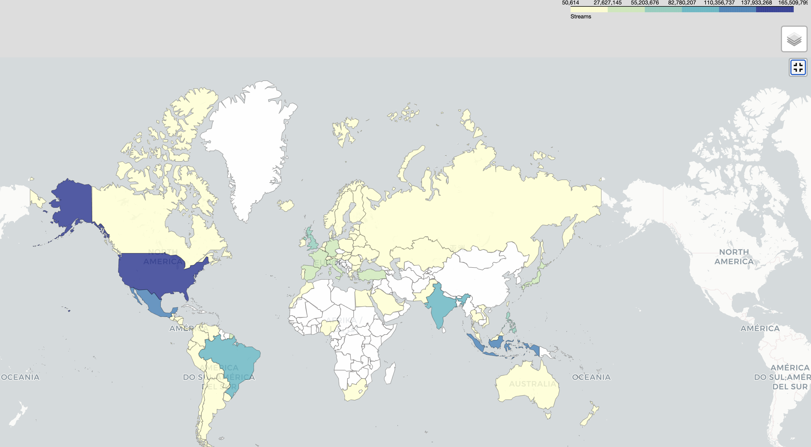

#### Top 20 genres represented by the Top 500 global artists

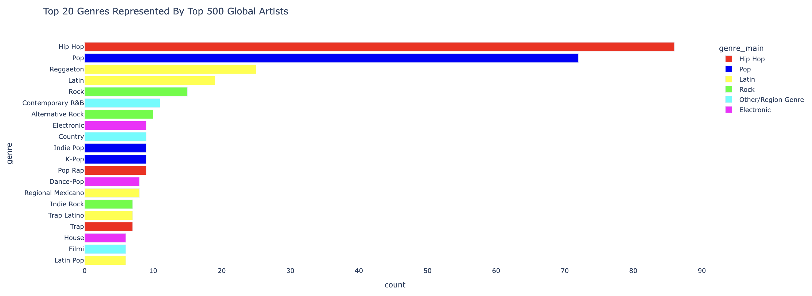

#### Music consumption by artist locality and country

[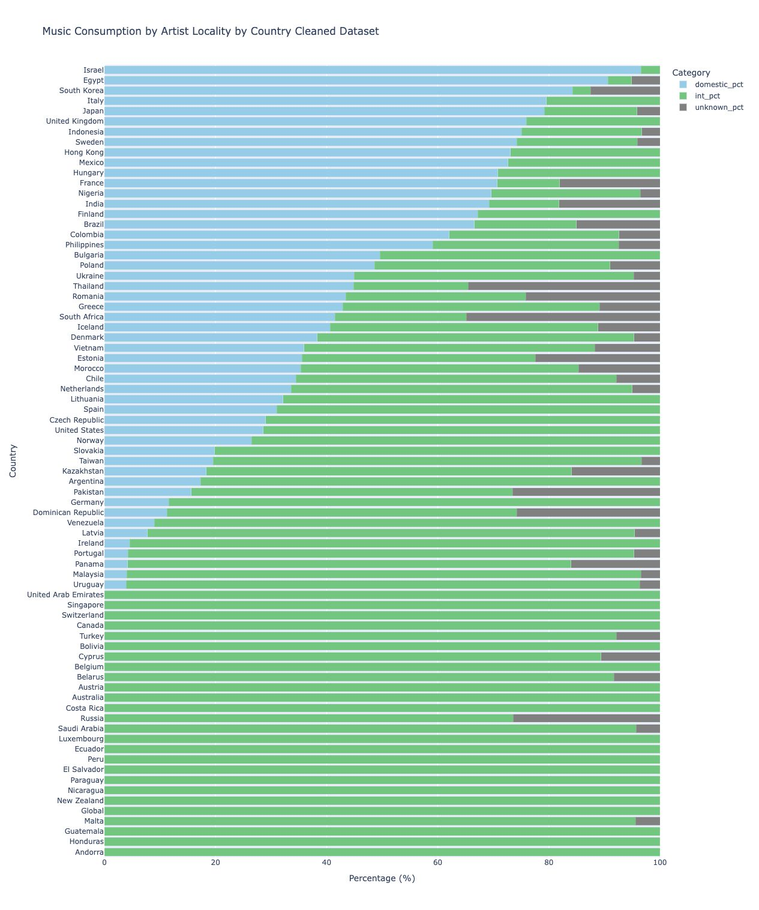](visualizations/artist_locality_interactive_clean.html)

#### Country-to-country streaming interaction network

[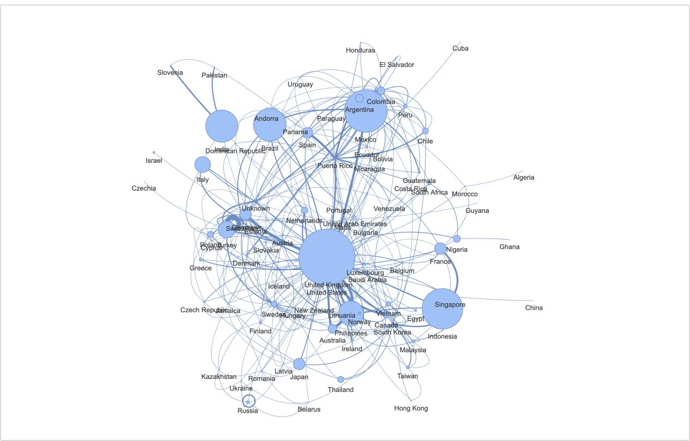](visualizations/web_plot.html)

### Song comparisons across markets

Song duration averaged about 217 seconds (3 minutes 37 seconds), with most tracks falling between roughly 160 and 270 seconds. Duration distributions differed by market: Italy was concentrated around shorter tracks, while India had a much wider range.

#### Song duration
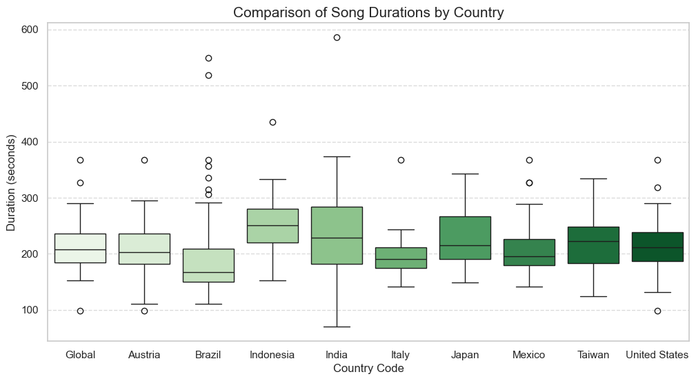

The combined distribution across all selected charts centers near 217 seconds but includes both very short tracks and outliers longer than six minutes.

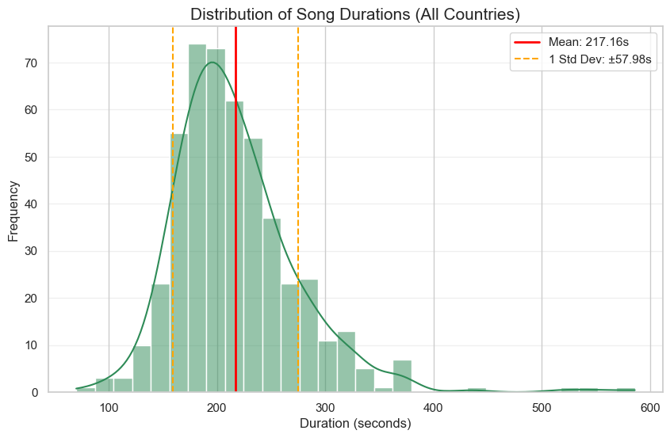

Despite these regional differences, Spearman correlation tests found **no statistically significant relationship between song duration and chart rank** in any of the ten markets examined (all p-values greater than 0.05).

#### Explicit content
The explicit-content label also varied sharply: 32% of the US Top 50, 22% of the Global Top 50, and 4% of Taiwan's Top 50 were labeled explicit while the other selected markets had none.

| Region or country | Explicit songs | Explicit share |
|---|---:|---:|
| United States | 16 / 50 | 32% |
| Global | 11 / 50 | 22% |
| Taiwan | 2 / 50 | 4% |
| Other selected countries | 0 / 50 | 0% |

#### Song age
Brazil, Italy, and Mexico showed stronger concentrations of recent releases, although several decades-old songs resurfaced because of television, meme, and TikTok trends.

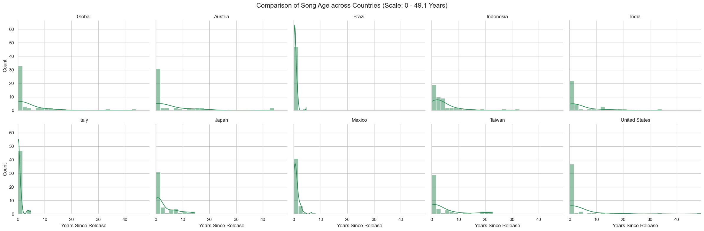

### NLP analysis of popular lyrics

Latent Dirichlet Allocation (LDA) identified five recurring themes in the 198-song US lyrics corpus:

| Theme | Songs | Share |
|---|---:|---:|
| Romantic emotion and separation | 48 | 24.2% |
| Summer and nighttime mood | 45 | 22.7% |
| Nightlife and club atmosphere | 41 | 20.7% |
| Drinking and emotional reflection | 40 | 20.2% |
| Heartbreak and sadness | 22 | 11.1% |

The LDA visualization displays topic separation and the most salient words in the corpus. Select the preview to open the interactive version.

[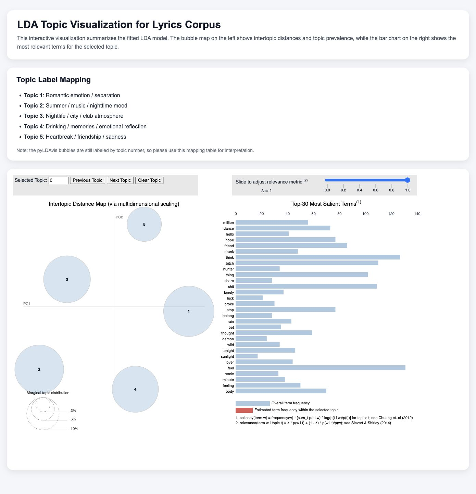](visualizations/lda_topics_results.html)

#### Sentiment Analysis
VADER sentiment analysis classified 130 songs (65.7%) as positive, 67 (33.8%) as negative, and one (0.5%) as neutral. Positive songs were the largest group in every chart-rank band, and average sentiment remained positive throughout the Top 200.

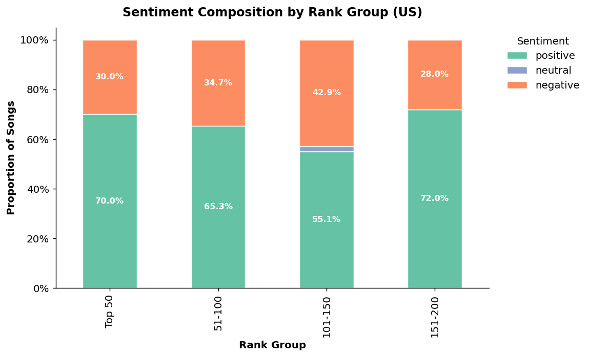

Average compound sentiment was positive in every rank group, although the 101-150 group had a noticeably lower average than the others.

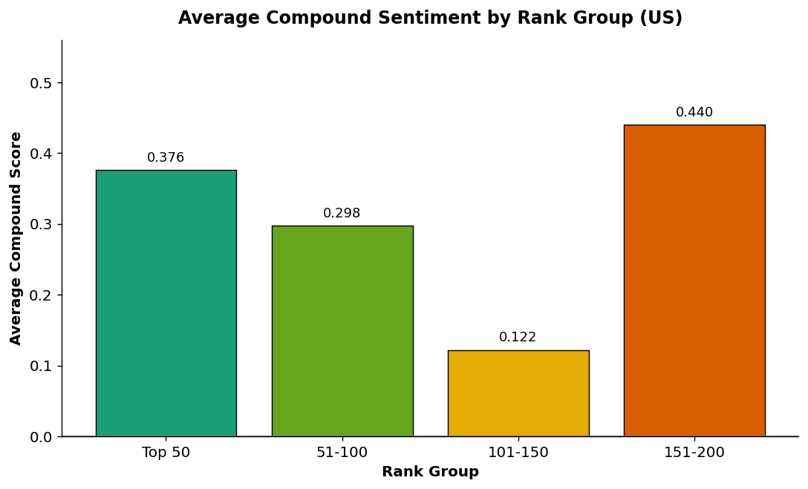

#### Keyword frequency
Frequent words—including *love*, *baby*, *know*, and *like*—reinforced the relationship and emotion themes found by LDA. Common bigrams and trigrams were often repeated vocal phrases, suggesting that rhythmic, memorable repetition is a prominent feature of popular lyrics.

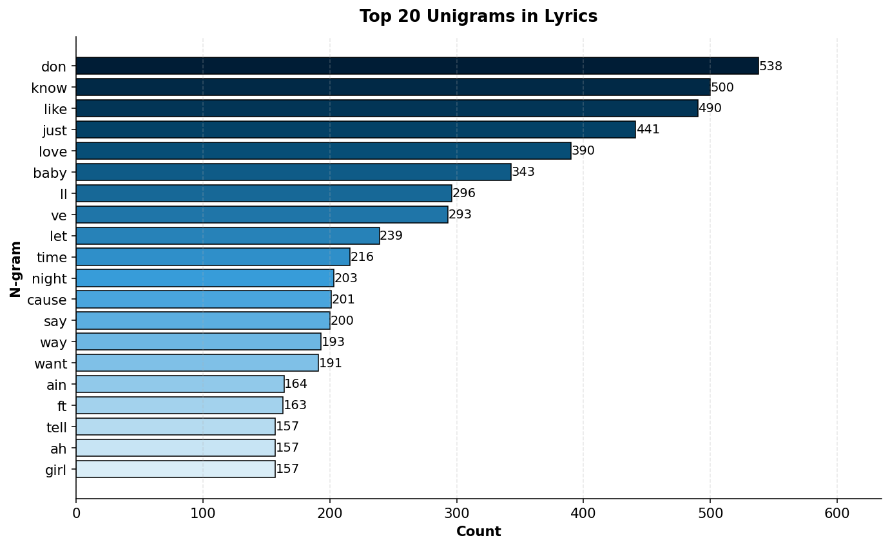

## Limitations

These results describe the sampled Spotify charts, not all music listeners. API rate limits restricted the number of songs and countries used in some analyses, weekly charts are sensitive to short-lived releases and cultural events, and MusicBrainz metadata contained substantial missingness (18.4% for artist country and 45.4% for genre after manual imputation). Genre and artist nationality are also inherently ambiguous. The lyrics analysis focused on the US chart and used English translations when available, so multilingual interpretation remains limited.

## Future work

A natural extension would be an interactive dashboard that refreshes as new chart data becomes available. An automated data pipeline could periodically retrieve Spotify rankings and metadata, update the country, song-feature, and lyrical analyses, and publish current visualizations alongside historical trends. This would make it possible to monitor emerging artists, shifting regional preferences, genre growth, and changes in song characteristics over time rather than relying on a single weekly snapshot.

Additional directions include comparing Spotify with other streaming platforms, expanding multilingual lyric analysis, aggregating charts over longer periods, and using clustering or predictive models to handle complex and missing genre labels.

## Repository guide

| Resource | Description |
|---|---|
| [`src/data_scraping.ipynb`](code/data_scraping.ipynb) | Chart scraping and API enrichment |
| [`src/country_comp.ipynb`](code/country_comp.ipynb) | Geographic, genre, artist-locality, and network analysis |
| [`src/song_trend.ipynb`](code/song_trend.ipynb) | Duration, explicit-content, release-date, and rank comparisons |
| [`src/lyrics_analysis.ipynb`](code/lyrics_analysis.ipynb) | LDA, VADER sentiment, and n-gram analysis |
| [`visualizations/`](visualizations/) | Static and interactive outputs |
| [`STA220_Final_Report.pdf`](STA220_Final_Report.pdf) | Full methodology, results, figures, and references |
| [`slides_march12slot2.pdf`](slides_march12slot2.pdf) | Presentation summarizing the questions, methods, and findings |

## Authors

Danny Kuei, Liang-yin Tao, and Chi-chun Chen  
Department of Statistics, University of California, Davis
